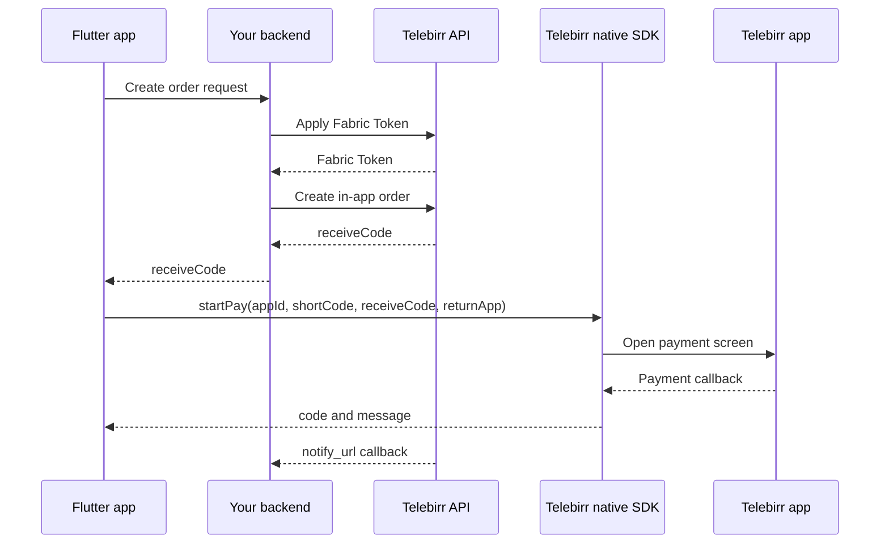

# telebirr_inapp_purchase_plus

Clean Flutter payments for the official Telebirr InApp Purchase SDK.

This package does one job: it starts the native Telebirr payment screen with the
`receiveCode` your backend already created, then returns the SDK callback to
Flutter.

## Successful Setup Steps

Follow these steps in order:

1. Create an Ethio Telecom developer account:
   [developer.ethiotelecom.et](https://developer.ethiotelecom.et/).
2. Create or join your organization/team.
3. Make sure your team member status is approved:
   [developer.ethiotelecom.et/user/team](https://developer.ethiotelecom.et/user/team).
4. Subscribe/contract the Telebirr InApp Purchase product for testbed or production.
5. Get your merchant App ID, Fabric App ID, short code, App Secret, and private key from the portal.
6. Build a backend endpoint that applies Fabric Token, creates the Telebirr order, and returns `receiveCode`.
7. Add this package to Flutter:

   ```yaml
   dependencies:
     telebirr_inapp_purchase_plus: ^0.0.3
   ```

8. Run:

   ```sh
   flutter pub get
   ```

9. Run the setup helper from your Flutter app root:

   ```sh
   dart run telebirr_inapp_purchase_plus:telebirr_setup \
     --sdk-dir /path/to/TelebirrSDKFolder \
     --return-scheme yourappscheme
   ```

10. Run:

   ```sh
   flutter clean
   flutter pub get
   cd ios && pod install
   ```

11. In Flutter, call your backend create-order endpoint and get `receiveCode`.
12. Call `TelebirrInAppPurchasePlus.startPay(...)`.
13. Show the SDK callback in the app.
14. Confirm final payment on your backend with `notify_url` or `queryOrder`.

If create order returns this error:

```text
60200098: Product is not subscribed or the contract status is not allowed to do this operation.
```

check the Ethio Telecom developer portal team approval and product contract
status, then create a new order.

## What You Build

Your backend:

- Gets a Fabric Token.
- Creates a Telebirr order.
- Signs requests with your private key.
- Receives `notify_url`.
- Verifies payment with `queryOrder` when needed.

Your Flutter app:

- Asks your backend to create an order.
- Receives `receiveCode`.
- Calls `TelebirrInAppPurchasePlus.startPay(...)`.
- Displays the SDK callback.

No app secret, private key, signing, token, create-order, query-order, or
notify-url code belongs in Flutter.

## How Telebirr InApp Purchase Works

Telebirr InApp Purchase is a server-assisted native app payment flow. Your app
does not create the payment directly. Your backend creates the order with
Telebirr first, then the mobile app opens the Telebirr payment app using the
`receiveCode` returned by that backend order.



Important point: the SDK callback tells your app what the native SDK returned.
For final business confirmation, trust your backend `notify_url` or `queryOrder`
result.

## How This Package Works

`telebirr_inapp_purchase_plus` is a thin, typed bridge between Flutter and the
official native Telebirr SDK.

- Dart validates the required payment fields before calling native code.
- Android uses `MethodChannel` to call Kotlin and `EventChannel` for callbacks.
- iOS uses `MethodChannel` to call Swift and `EventChannel` for callbacks.
- Native code builds Telebirr `PayInfo` and calls the official SDK `startPay`.
- SDK callback codes are converted into `TelebirrPaymentResult`.

The package does not talk to Telebirr REST APIs. It only starts the payment with
the `receiveCode` your backend already created.

## Package API

Use `TelebirrPaymentRequest` when you are ready to open Telebirr:

```dart
final request = TelebirrPaymentRequest(
  appId: 'YOUR_MERCHANT_APP_ID',
  shortCode: 'YOUR_SHORT_CODE',
  receiveCode: receiveCodeFromBackend,
  returnApp: 'yourappscheme',
  environment: TelebirrEnvironment.test,
);
```

Use `TelebirrPaymentResult` to handle the callback:

```dart
if (result.isSuccess) {
  // Payment SDK returned success.
} else if (result.isCancelled) {
  // User cancelled from Telebirr.
} else if (result.isAppNotInstalled) {
  // Ask the user to install Telebirr.
}
```

## Install

```yaml
dependencies:
  telebirr_inapp_purchase_plus: ^0.0.3
```

Then run:

```sh
flutter pub get
```

## Fast Setup

After `flutter pub get`, run the setup helper from your Flutter app root:

```sh
dart run telebirr_inapp_purchase_plus:telebirr_setup \
  --sdk-dir /path/to/TelebirrSDKFolder \
  --return-scheme yourappscheme
```

The setup helper:

- copies Telebirr Android AAR files into the package cache
- creates Android local Maven artifacts
- copies `EthiopiaPaySDK.framework` into the package cache
- changes Android `MainActivity` to `FlutterFragmentActivity`
- adds iOS `telebirrcustomerApp` query scheme
- adds your iOS return URL scheme

Then run:

```sh
flutter clean
flutter pub get
cd ios && pod install
```

## Native SDK Files

Telebirr provides the native SDK as local files. Put all official Telebirr SDK
files in one folder, then pass that folder to the setup helper.

Place the official files here in this package or your local checkout:

```text
android/libs/EthiopiaPaySdkModule-uat-release.aar
android/libs/EthiopiaPaySdkModule-prod-release.aar
ios/Frameworks/EthiopiaPaySDK.framework
```

For local development, you can copy files from a Telebirr SDK folder:

```sh
./scripts/install_telebirr_sdks.sh /path/to/TelebirrSDKFolder
```

For app developers using this package from pub.dev, prefer:

```sh
dart run telebirr_inapp_purchase_plus:telebirr_setup \
  --sdk-dir /path/to/TelebirrSDKFolder \
  --return-scheme yourappscheme
```

## Flutter Usage

```dart
final request = TelebirrPaymentRequest(
  appId: 'YOUR_MERCHANT_APP_ID',
  shortCode: 'YOUR_SHORT_CODE',
  receiveCode: receiveCodeFromBackend,
  returnApp: 'yourappscheme',
  environment: TelebirrEnvironment.test,
);

final result = await TelebirrInAppPurchasePlus.startPay(request);

if (result.isSuccess) {
  print('Payment successful');
} else if (result.isCancelled) {
  print('Payment cancelled');
} else if (result.isAppNotInstalled) {
  print('Telebirr app is not installed');
} else {
  print('Payment failed: ${result.message}');
}
```

Stream callback:

```dart
final sub = TelebirrInAppPurchasePlus.paymentResultStream.listen((result) {
  print('Telebirr callback: ${result.code} - ${result.message}');
});
```

## Backend Response

Your app can call any backend route you choose. The example app expects this:

```json
{
  "success": true,
  "merchantOrderId": "1705460512562",
  "receiveCode": "TELEBIRR$BUYGOODS$100100306$12.00$080075a4e3213924de2b3b84ad3cac0a6a6001$120m"
}
```

See [doc/backend.md](doc/backend.md) for a small Laravel-style example.

## Developer Checklist

1. Create an account at [developer.ethiotelecom.et](https://developer.ethiotelecom.et/).
2. Create or join your organization/team.
3. Confirm your organization member status is approved at [developer.ethiotelecom.et/user/team](https://developer.ethiotelecom.et/user/team).
4. Subscribe/contract the Telebirr InApp Purchase product for test or production.
5. Build backend create-order endpoint.
6. Keep App Secret and private key only on backend.
7. Run `dart run telebirr_inapp_purchase_plus:telebirr_setup`.
8. Call backend from Flutter to get `receiveCode`.
9. Call `startPay`.
10. Confirm final payment on backend with `notify_url` or `queryOrder`.

## What Is Automatic?

Some setup is handled by the package, but some setup must stay in the app or
backend because it is app-specific or secret.

| Requirement | Automatic? | Notes |
| --- | --- | --- |
| Dart payment API | Yes | `TelebirrPaymentRequest`, `TelebirrPaymentResult`, `startPay`, and callback stream are included. |
| Android native SDK call | Yes | The plugin calls `PaymentManager.getInstance().pay(...)`. |
| Android payment callback | Yes | The plugin sends callbacks to Flutter through `EventChannel`. |
| Android `INTERNET` permission | Yes | Declared by the plugin manifest. |
| Android Telebirr package visibility | Yes | Declared by the plugin manifest. |
| Android ProGuard keep rule | Yes | Included as a consumer ProGuard rule. |
| iOS native SDK call | Yes | The plugin calls `EthiopiaPayManager.shared().startPay(...)`. |
| iOS SDK callback stream | Yes | The plugin sends callbacks to Flutter through `EventChannel`. |
| iOS `openURL` forwarding | Mostly | The plugin registers an application delegate. Apps with custom URL routing must not swallow the Telebirr URL. |
| Telebirr AAR files | Setup helper | The helper copies official SDK files from your Telebirr SDK folder. |
| iOS `EthiopiaPaySDK.framework` | Setup helper | The helper copies the official framework from your Telebirr SDK folder. |
| Android `FlutterFragmentActivity` | Setup helper | The helper patches common Kotlin/Java `MainActivity` files. |
| iOS URL scheme | Setup helper | Pass `--return-scheme yourappscheme`. |
| Backend create-order endpoint | No | Must stay on your backend because it uses secrets and signing. |
| App Secret/private key storage | No | Never put these in Flutter. |
| `notify_url` and `queryOrder` | No | Must be handled by your backend. |

## Android Setup

1. Add the Telebirr AAR files:

   ```text
   android/libs/EthiopiaPaySdkModule-uat-release.aar
   android/libs/EthiopiaPaySdkModule-prod-release.aar
   ```

2. Use `FlutterFragmentActivity` in the host app:

   ```kotlin
   import io.flutter.embedding.android.FlutterFragmentActivity

   class MainActivity : FlutterFragmentActivity()
   ```

3. Keep this ProGuard rule if you customize shrinking:

   ```proguard
   -keep class com.huawei.ethiopia.pay.sdk.api.core.** { *; }
   ```

The plugin already declares `INTERNET` permission and package visibility for
the Telebirr payment app.

## iOS Setup

1. Add the official framework:

   ```text
   ios/Frameworks/EthiopiaPaySDK.framework
   ```

2. Run:

   ```sh
   cd example/ios
   pod install
   ```

3. Add this to the host app `Info.plist`:

   ```xml
   <key>LSApplicationQueriesSchemes</key>
   <array>
     <string>telebirrcustomerApp</string>
   </array>
   ```

4. Add a URL Type for your return scheme, for example `yourappscheme`, and pass
   the same value as `returnApp`.

The plugin registers an application delegate and forwards `openURL` to the SDK.
If your app has custom AppDelegate or SceneDelegate URL routing, make sure it
does not swallow the Telebirr return URL before plugins receive it.

## Test And Production

- Test uses the UAT/testbed Telebirr app and UAT AAR/framework.
- Production uses the production Telebirr app and production SDK.
- Do not mix test `receiveCode` values with production credentials.
- Your backend base URL, Fabric App ID, App Secret, private key, short code,
  notify URL, and merchant app ID must all belong to the same environment.

## Ethio Telecom Developer Account

Before testing, create a developer account at
[developer.ethiotelecom.et](https://developer.ethiotelecom.et/). Your merchant,
team, and product contract must be active for the environment you are testing.

Check your team status here:
[developer.ethiotelecom.et/user/team](https://developer.ethiotelecom.et/user/team).

Your organization member status must be approved. If the team member, merchant,
contract, or product subscription is suspended or not approved, Telebirr can
return:

```text
60200098: Product is not subscribed or the contract status is not allowed to do this operation.
```

When you see this error, fix the developer portal/team/product subscription
status first, then create a new order.

## Error Codes

| Code | Meaning |
| ---: | --- |
| `0` | Payment success |
| `-1` | Unknown error |
| `-2` | Parameter error |
| `-3` | Payment cancelled |
| `-10` | Telebirr payment app is not installed |
| `-11` | Current Telebirr app version does not support this function |

## Example App

```sh
cd example
flutter pub get
flutter run
```

Fill in:

- Backend create-order URL.
- Merchant App ID.
- Short code.
- Return app scheme.
- Amount and title.

Tap **Create Order From Backend**, then **Pay With Telebirr**.

## Troubleshooting

- `receiveCode must start with TELEBIRR$`: return the exact `receiveCode` from your backend.
- `Telebirr app is not installed`: install the UAT or production Telebirr app.
- `NO_ACTIVITY`: Android host app must use `FlutterFragmentActivity`.
- `SDK_NOT_AVAILABLE` on iOS: copy `EthiopiaPaySDK.framework` and run `pod install`.
- `60200098`: check Ethio Telecom developer portal team approval and product contract status.
- Create order succeeds but payment fails: confirm app ID, short code, receive code, return scheme, and Telebirr app environment match.
- Backend callback missing: make `notify_url` public and verify with `queryOrder`.
