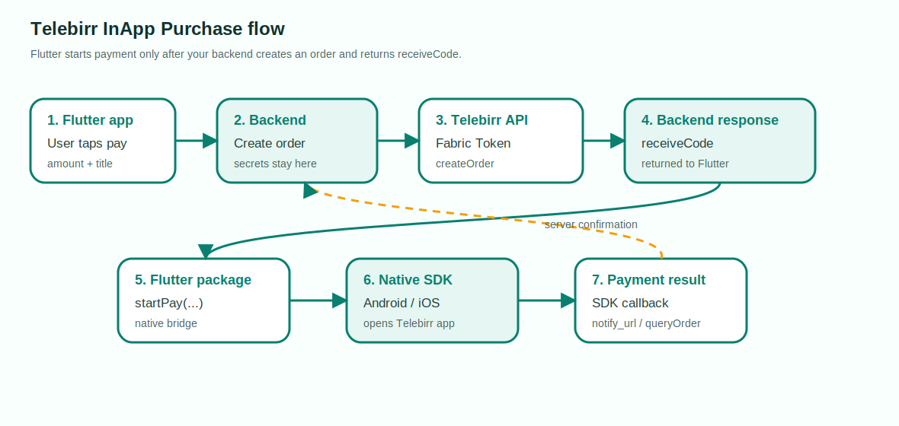

# telebirr_inapp_purchase_plus

Clean Flutter payments for the official Telebirr InApp Purchase SDK.

This package does one job: it starts the native Telebirr payment screen with the
`receiveCode` your backend already created, then returns the SDK callback to
Flutter.

Using an AI coding assistant to integrate this package into your app? Add or
reference [skills.md](skills.md) first so the assistant asks for the required
backend URL, merchant values, return scheme, environment, and checkout flow
before changing code.

## Plug-And-Play Setup

1. Install:

   ```yaml
   dependencies:
     telebirr_inapp_purchase_plus: ^1.0.3
   ```

2. Initialize once before payment:

   ```dart
   await Telebirr.initialize(
     // Merchant App ID from the Ethio Telecom developer portal.
     appId: 'YOUR_MERCHANT_APP_ID',

     // Merchant business short code from the Ethio Telecom developer portal.
     shortCode: 'YOUR_SHORT_CODE',

     // Optional return app scheme.
     //
     // If omitted, the package generates one from your Android package name
     // or iOS bundle ID. Pass this only when your app/Telebirr contract uses
     // a known scheme, for example 'peaceride'.
     returnScheme: 'yourappscheme',

     // Use test for testbed and production for live payments.
     environment: TelebirrEnvironment.test,

     // Optional integration logs.
     enableLogs: true,
   );
   ```

3. Ask your backend to create an order and return `receiveCode`.

4. Pay with the backend-created `receiveCode`:

   ```dart
   final result = await Telebirr.pay(
     receiveCode: receiveCodeFromBackend,
   );
   ```

5. Optional diagnostics:

   ```sh
   dart run telebirr_inapp_purchase_plus:doctor
   ```

The package handles Android manifest entries, package visibility, ProGuard,
native platform channels, SDK callbacks, environment selection, and return
scheme generation. Flutter developers should not edit Telebirr native payment
code.

## Return App Scheme And iOS

`returnScheme` is the URL scheme Telebirr uses to return control to your app
after the customer finishes or cancels payment.

Recommended:

```dart
await Telebirr.initialize(
  appId: 'YOUR_MERCHANT_APP_ID',
  shortCode: 'YOUR_SHORT_CODE',
  returnScheme: 'yourappscheme',
);
```

What the package does:

- Uses your `returnScheme` when starting the native Telebirr SDK.
- Generates a return scheme automatically if you omit it.
- Registers native iOS `openURL` forwarding inside the plugin.
- Handles SDK callbacks through Flutter streams and payment results.

What you do on iOS:

- If you already have a custom URL scheme, pass the same value as
  `returnScheme`.
- If your app has a custom `AppDelegate` or `SceneDelegate`, do not block the
  Telebirr return URL before Flutter plugins receive it.
- Run `dart run telebirr_inapp_purchase_plus:doctor` if payment does not return
  to the app.

## Successful Setup Steps

Follow these steps in order:

1. Create an Ethio Telecom developer account:
   [developer.ethiotelecom.et](https://developer.ethiotelecom.et/).
2. Create or join your organization/team.
3. Make sure your team member status is approved:
   [developer.ethiotelecom.et/user/team](https://developer.ethiotelecom.et/user/team).
4. Subscribe/contract the Telebirr InApp Purchase product for testbed or production.
5. Get your merchant App ID, Fabric App ID, short code, App Secret, and private key from the portal.
6. Build a backend endpoint that applies Fabric Token, creates the Telebirr order, and returns `receiveCode`.
7. Add this package to Flutter:

   ```yaml
   dependencies:
     telebirr_inapp_purchase_plus: ^1.0.1
   ```

8. Run:

   ```sh
   flutter pub get
   ```

9. Optional: run Telebirr Doctor from your Flutter app root:

   ```sh
   dart run telebirr_inapp_purchase_plus:doctor
   ```

10. Run:

   ```sh
   flutter clean
   flutter pub get
   cd ios && pod install
   ```

11. In Flutter, call your backend create-order endpoint and get `receiveCode`.
12. Call `Telebirr.initialize(...)`, then `Telebirr.pay(...)`.
13. Show the SDK callback in the app.
14. Confirm final payment on your backend with `notify_url` or `queryOrder`.

## Where To Add Payment Values

These values are entered in your Flutter app or passed in your Flutter code:

| Value | Where it comes from | Where to put it |
| --- | --- | --- |
| Backend create-order URL | Your backend team | In the example app field **Backend create-order URL**, or your own `http.post` URL. |
| Merchant App ID | Ethio Telecom developer portal | In the example app field **App ID**, or `TelebirrPaymentRequest.appId`. |
| Short code | Ethio Telecom developer portal | In the example app field **Short code**, or `TelebirrPaymentRequest.shortCode`. |
| Return app scheme | Usually generated by the package. You may pass your own iOS URL scheme, for example `myshop`. | `Telebirr.initialize(returnScheme: 'myshop')`. Use the same value if your Telebirr contract expects a specific return scheme. |
| Amount | Your checkout screen | Send it to your backend create-order endpoint. |
| Title | Your checkout/order name | Send it to your backend create-order endpoint. |

Example app path:

```sh
cd example
flutter run
```

Then fill:

1. **Backend create-order URL**: `https://yourdomain.com/api/telebirr/create-order`
2. **App ID**: your Merchant App ID
3. **Short code**: your merchant short code
4. **Return app scheme**: the same scheme used in setup, for example `myshop`
5. **Amount**: for example `12.00`
6. **Title**: for example `Test order`
7. Tap **Create Order From Backend**
8. Tap **Pay With Telebirr**

If create order returns this error:

```text
60200098: Product is not subscribed or the contract status is not allowed to do this operation.
```

check the Ethio Telecom developer portal team approval and product contract
status, then create a new order.

## What You Build

Your backend:

- Gets a Fabric Token.
- Creates a Telebirr order.
- Signs requests with your private key.
- Receives `notify_url`.
- Verifies payment with `queryOrder` when needed.

Your Flutter app:

- Asks your backend to create an order.
- Receives `receiveCode`.
- Calls `Telebirr.pay(...)`.
- Displays the SDK callback.

No app secret, private key, signing, token, create-order, query-order, or
notify-url code belongs in Flutter.

## How Telebirr InApp Purchase Works

Telebirr InApp Purchase is a server-assisted native app payment flow. Your app
does not create the payment directly. Your backend creates the order with
Telebirr first, then the mobile app opens the Telebirr payment app using the
`receiveCode` returned by that backend order.



Important point: the SDK callback tells your app what the native SDK returned.
For final business confirmation, trust your backend `notify_url` or `queryOrder`
result.

## How This Package Works

`telebirr_inapp_purchase_plus` is a thin, typed bridge between Flutter and the
official native Telebirr SDK.

- Dart validates the required payment fields before calling native code.
- Android uses `MethodChannel` to call Kotlin and `EventChannel` for callbacks.
- iOS uses `MethodChannel` to call Swift and `EventChannel` for callbacks.
- Native code builds Telebirr `PayInfo` and calls the official SDK `startPay`.
- SDK callback codes are converted into `TelebirrPaymentResult`.

The package does not talk to Telebirr REST APIs. It only starts the payment with
the `receiveCode` your backend already created.

## Package API

Use `TelebirrPaymentRequest` when you are ready to open Telebirr:

```dart
final request = TelebirrPaymentRequest(
  appId: 'YOUR_MERCHANT_APP_ID',
  shortCode: 'YOUR_SHORT_CODE',
  receiveCode: receiveCodeFromBackend,
  returnApp: 'yourappscheme',
  environment: TelebirrEnvironment.test,
);
```

Use `TelebirrPaymentResult` to handle the callback:

```dart
if (result.isSuccess) {
  // Payment SDK returned success.
} else if (result.isCancelled) {
  // User cancelled from Telebirr.
} else if (result.isAppNotInstalled) {
  // Ask the user to install Telebirr.
}
```

## Install

```yaml
dependencies:
  telebirr_inapp_purchase_plus: ^1.0.1
```

Then run:

```sh
flutter pub get
```

## Fast Setup

After `flutter pub get`, initialize Telebirr from Dart:

```dart
await Telebirr.initialize(
  appId: 'YOUR_MERCHANT_APP_ID',
  shortCode: 'YOUR_SHORT_CODE',
  returnScheme: 'yourappscheme',
  environment: TelebirrEnvironment.test,
);
```

Then run:

```sh
flutter pub get
cd ios && pod install
```

Optional diagnostics:

```sh
dart run telebirr_inapp_purchase_plus:doctor
```

## Flutter Usage

```dart
await Telebirr.initialize(
  appId: 'YOUR_MERCHANT_APP_ID',
  shortCode: 'YOUR_SHORT_CODE',
  environment: TelebirrEnvironment.test,
);

final result = await Telebirr.pay(receiveCode: receiveCodeFromBackend);

if (result.isSuccess) {
  print('Payment successful');
} else if (result.isCancelled) {
  print('Payment cancelled');
} else if (result.isAppNotInstalled) {
  print('Telebirr app is not installed');
} else {
  print('Payment failed: ${result.message}');
}
```

Stream callback:

```dart
final sub = TelebirrInAppPurchasePlus.paymentResultStream.listen((result) {
  print('Telebirr callback: ${result.code} - ${result.message}');
});
```

## Backend Response

Your app can call any backend route you choose. The example app expects this:

```json
{
  "success": true,
  "merchantOrderId": "1705460512562",
  "receiveCode": "TELEBIRR$BUYGOODS$100100306$12.00$080075a4e3213924de2b3b84ad3cac0a6a6001$120m"
}
```

See [doc/backend.md](doc/backend.md) for a small Laravel-style example.

## Backend Curl Example

Send amount and title to your own backend. Use your testbed backend URL while
testing and your production backend URL after go-live.

Testbed example:

```sh
curl -X POST "https://your-test-domain.com/api/telebirr/create-order" \
  -H "Accept: application/json" \
  -H "Content-Type: application/json" \
  -d '{
    "amount": "12.00",
    "title": "Test order",
    "environment": "test"
  }'
```

Production example:

```sh
curl -X POST "https://yourdomain.com/api/telebirr/create-order" \
  -H "Accept: application/json" \
  -H "Content-Type: application/json" \
  -d '{
    "amount": "12.00",
    "title": "Production order",
    "environment": "production"
  }'
```

Backend response:

```json
{
  "success": true,
  "merchantOrderId": "1705460512562",
  "receiveCode": "TELEBIRR$BUYGOODS$100100306$12.00$080075a4e3213924de2b3b84ad3cac0a6a6001$120m"
}
```

Use the returned `receiveCode` in Flutter:

```dart
final request = TelebirrPaymentRequest(
  appId: 'YOUR_MERCHANT_APP_ID',
  shortCode: 'YOUR_SHORT_CODE',
  receiveCode: backendResponse.receiveCode,
  returnApp: 'myshop',
  environment: TelebirrEnvironment.test,
);

final result = await TelebirrInAppPurchasePlus.startPay(request);
```

The old `TelebirrPaymentRequest` API is still supported for existing apps. New
apps should prefer `Telebirr.initialize(...)` and `Telebirr.pay(...)`.

For production, use production merchant values and switch the environment:

```dart
await Telebirr.initialize(
  appId: 'YOUR_PRODUCTION_MERCHANT_APP_ID',
  shortCode: 'YOUR_PRODUCTION_SHORT_CODE',
  returnScheme: 'myshop',
  environment: TelebirrEnvironment.production,
);

final result = await Telebirr.pay(
  receiveCode: backendResponse.receiveCode,
);
```

## Developer Checklist

1. Create an account at [developer.ethiotelecom.et](https://developer.ethiotelecom.et/).
2. Create or join your organization/team.
3. Confirm your organization member status is approved at [developer.ethiotelecom.et/user/team](https://developer.ethiotelecom.et/user/team).
4. Subscribe/contract the Telebirr InApp Purchase product for test or production.
5. Build backend create-order endpoint.
6. Keep App Secret and private key only on backend.
7. Optional: run `dart run telebirr_inapp_purchase_plus:doctor`.
8. Call backend from Flutter to get `receiveCode`.
9. Call `Telebirr.initialize(...)`, then `Telebirr.pay(...)`.
10. Confirm final payment on backend with `notify_url` or `queryOrder`.

## What The Package Does Automatically

Flutter developers do not need to write native Android or iOS payment code. The
package handles the native bridge and common host app settings.

| Requirement | Automatic? | Notes |
| --- | --- | --- |
| Dart payment API | Yes | `Telebirr.initialize`, `Telebirr.pay`, `TelebirrPaymentResult`, legacy `startPay`, and callback stream are included. |
| Android native SDK call | Yes | The plugin calls `PaymentManager.getInstance().pay(...)`. |
| Android payment callback | Yes | The plugin sends callbacks to Flutter through `EventChannel`. |
| Android `INTERNET` permission | Yes | Declared by the plugin manifest. |
| Android Telebirr package visibility | Yes | Declared by the plugin manifest. |
| Android ProGuard keep rule | Yes | Included as a consumer ProGuard rule. |
| iOS native SDK call | Yes | The plugin calls `EthiopiaPayManager.shared().startPay(...)`. |
| iOS SDK callback stream | Yes | The plugin sends callbacks to Flutter through `EventChannel`. |
| iOS `openURL` forwarding | Mostly | The plugin registers an application delegate. Apps with custom URL routing must not swallow the Telebirr URL. |
| Native SDK dependencies | Yes | The plugin Gradle/CocoaPods integration owns native SDK loading for app developers. |
| Android activity compatibility | Mostly | Android payment UI requires a fragment-capable activity. The example app is already configured. |
| iOS URL scheme | Mostly | Pass `returnScheme` to `Telebirr.initialize`. The package registers URL handling; if your app has custom URL routing, do not swallow Telebirr return URLs. |
| Backend create-order endpoint | No | Must stay on your backend because it uses secrets and signing. |
| App Secret/private key storage | No | Never put these in Flutter. |
| `notify_url` and `queryOrder` | No | Must be handled by your backend. |

More detail: [doc/what-package-does.md](doc/what-package-does.md).

## Test And Production

- Test uses the UAT/testbed Telebirr app and UAT AAR/framework.
- Production uses the production Telebirr app and production SDK.
- Do not mix test `receiveCode` values with production credentials.
- Your backend base URL, Fabric App ID, App Secret, private key, short code,
  notify URL, and merchant app ID must all belong to the same environment.

## Ethio Telecom Developer Account

Before testing, create a developer account at
[developer.ethiotelecom.et](https://developer.ethiotelecom.et/). Your merchant,
team, and product contract must be active for the environment you are testing.

Check your team status here:
[developer.ethiotelecom.et/user/team](https://developer.ethiotelecom.et/user/team).

Your organization member status must be approved. If the team member, merchant,
contract, or product subscription is suspended or not approved, Telebirr can
return:

```text
60200098: Product is not subscribed or the contract status is not allowed to do this operation.
```

When you see this error, fix the developer portal/team/product subscription
status first, then create a new order.

## Error Codes

| Code | Meaning |
| ---: | --- |
| `0` | Payment success |
| `-1` | Unknown error |
| `-2` | Parameter error |
| `-3` | Payment cancelled |
| `-10` | Telebirr payment app is not installed |
| `-11` | Current Telebirr app version does not support this function |

## Example App

```sh
cd example
flutter pub get
flutter run
```

Fill in:

- **Backend create-order URL** from your backend.
- **App ID** from Ethio Telecom developer portal.
- **Short code** from Ethio Telecom developer portal.
- **Return app scheme** passed to `Telebirr.initialize(returnScheme: ...)` or generated automatically.
- **Amount** and **Title** for the order.

Tap **Create Order From Backend**, then **Pay With Telebirr**.

## Troubleshooting

- `receiveCode must start with TELEBIRR$`: return the exact `receiveCode` from your backend.
- `Telebirr app is not installed`: install the UAT or production Telebirr app.
- `NO_ACTIVITY`: Android host app must use `FlutterFragmentActivity`.
- `SDK_NOT_AVAILABLE` on iOS: copy `EthiopiaPaySDK.framework` and run `pod install`.
- `60200098`: check Ethio Telecom developer portal team approval and product contract status.
- Create order succeeds but payment fails: confirm app ID, short code, receive code, return scheme, and Telebirr app environment match.
- Backend callback missing: make `notify_url` public and verify with `queryOrder`.

## Contact Us

Need support with Telebirr integration, websites, mobile apps, or custom
software? Contact Dream Technologies PLC:
[dreamtech.et/contact](https://dreamtech.et/contact)
